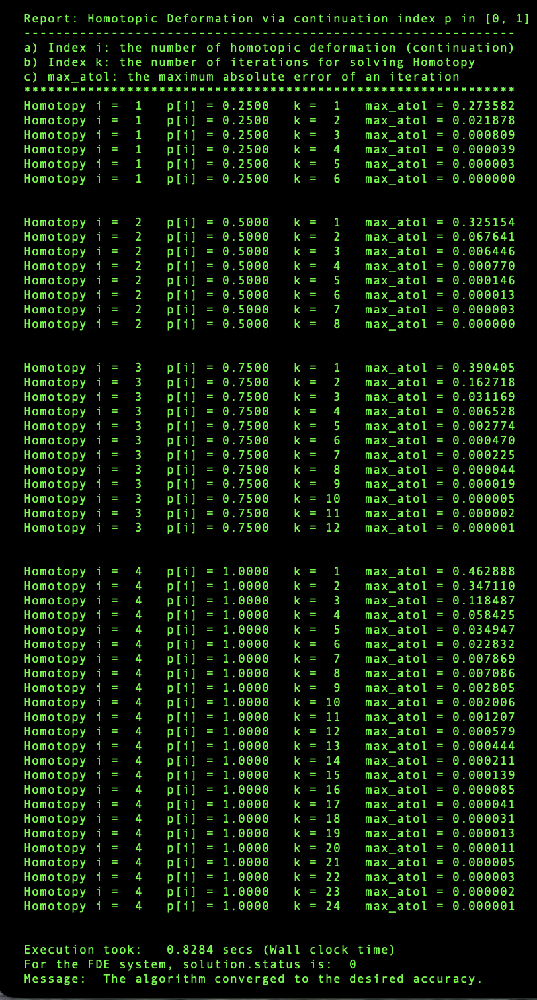
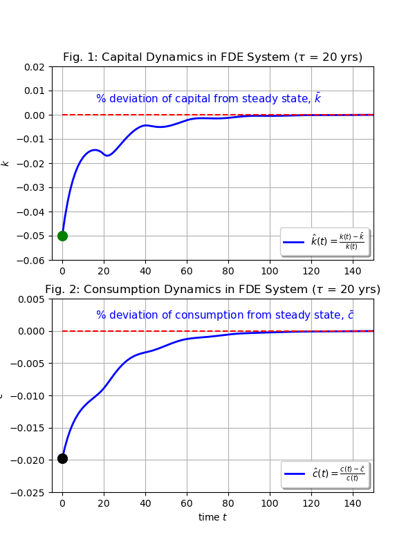

# Homotopy_MFDEs
This repository provides a Python program to solve a two-dimensional dynamical system of mixed-type functional differential equations (MFDEs) resulting from the Time-to-Build growth model derived in Lin (2018) [https://doi.org/10.1007/s10614-016-9633-9]

### A. The Python program 

This program is coded in the Python language (Python 3.13.5), including two source files: 

[main.py](./Python_Program/main.py) and [FDEmodel.py](./Python_Program/FDEmodel.py)

The source file of main.py is the program's driver while the source file of FDEmodel.py declares a Python class called "model" that provides class functions essentially to define three dynamical systems for the program to implement the Homotopy-continuation algorithm. In generic terms, the three dynamical systems are given below:

Start System of ODEs: $\hspace{1.1cm}$ $G(t, y(t))$

Target System of MFDEs: $\hspace{0.58cm}$ $F(t, y(t), y(t-\tau), y(t+\tau)),\,\,\,\tau>0$

Homotopic System: $\hspace{1.59cm}$ $H(t, y(t), p),\,\,\,p\in [0,1]$

To run the Python program, you will need to download and place main.py (the driver) and FDEmodel.py (the class) in the same folder (directory). On the command line, enter **python main.py** and wait in an instant to see the iteration process and graphical output on the console: 

  
<b>[Screenshot of Homotopy Continuation]</b>

   
  

  
<b>[Plot of Results]</b>

   
  

### B. License

This Python program is licensed under the [MIT License](LICENSE).

### C. The "Time-to_Build growth" Model: 

The Python program is designed to solve a mathematically complicated dynamical system, denoted by the Target System F(.), formed by two mixed-type functional differential equations (MFDEs) based on a neoclassical growth model that features the element of  "Time-to-Build" capital. The Target System is explicitly given below: 

$$
\begin{equation}
\dot{k}(t) = A  k(t-\tau)^\alpha - c(t) - \delta  k(t-\tau)\hspace{6cm}(1) 
\end{equation}
$$

$$
\begin{equation}
\dot{c}(t) = \frac{1}{\sigma} c(t) \left( \left[A \alpha k(t)^{\alpha-1} - \delta\right]\left[\frac{c(t)}{c(t+\tau)}\right]^\sigma  e^{-\rho \tau} - \rho \right) \hspace{3cm}(2)
\end{equation}
$$

where $\dot{k}(t)\equiv\frac{dk(t)}{dt}$ and $\dot{c}(t)\equiv\frac{dc(t)}{dt}$.
                            
Independent variable: 

$\hspace{1cm}t \in [0, \infty)$

Dependent variables: k(t), c(t)

$\hspace{1cm}k(t)$ - capital stock at time $t$, a predetermined state variable.

$\hspace{1cm}c(t)$ - consumption at time $t$, a jump variable.

In the long-run steady state:

$\hspace{1cm}k(t) \rightarrow k_{ss}$ at $t \rightarrow \infty$

$\hspace{1cm}c(t) \rightarrow c_{ss}$ at $t \rightarrow \infty$ 
    
In the present ($t = 0$):

$\hspace{1cm}k(t) = k_0 > 0$ at $t = 0$
$\hspace{1cm}c(t)$ at $t = 0:$ not predetermined 
 
History in the pre-shape interval $[-\tau,0)$:

$\hspace{1cm}k(t) = k_0 > 0$ at $t \in [-\tau, 0)$

$\hspace{1cm}c(t) =$ not available data at $t \in [-\tau, 0)$

Model Parameters:

$\hspace{1cm}A$: technical shift $(A >0)$

$\hspace{1cm}\rho$: time preference $(\rho>0)$

$\hspace{1cm}\alpha$: capital share $(0<\alpha<1)$

$\hspace{1cm}\sigma$: relative risk aversion $(\sigma > 0)$ 
=> $1/\sigma =$ elasticity of intertemporal substitution

$\hspace{1cm}\delta$: capital depreciation rate $(0<\delta<1)$

$\hspace{1cm}\tau$: the delay/advance parameter $(\tau>0)$

### D. Three Dynamical Systems

Equations (1)-(2) represent the Target System (MFDEs), denoted by $F(.)$, where equation (1) is a "delay differential equation" (DDE) due to the delay term, $k(t-\tau)$, while equation (2) is an "advance differential equation" (ADE) due to the advance term, $c(t+\tau)$. 

If parameter $\tau$ is set equal to zero, equations (1)-(2) reduce
to a system of two ordinary differential equations (ODEs), denoted by $G(.)$, which is called the Start System in the Python program. 

We form the linear homotopic system H(.):

$$
\begin{equation}
H(t, y(t), p) = (1-p)G(t, y(t)) + p F(t, y(t), y(t-\tau), y(t+\tau))\hspace{2cm}(3)
\end{equation}
$$

where $p\in[0,1]$ is the continuation parameter. 

The MFDE system presents a complicated boundary value problem (BVP) because
the system's current state is subject to the "non-local" states in history and the future. 

### E. Algorithm: 

The Python program uses a homotopic continuation method to solve the MFDE
system. This numerical method, proposed and demonstrated in Lin (2018), is
to solve the MFDE system (1)-(2) by solving a functional sequence of 
$p$-constructed homotopic systems with $p \in [0, 1]$. 
    
All these $p$-constructed homotopic systems, or the "Homotopy" for brevity, 
are formed by ODEs since we design an approximant (provided in the Python class) to parametrize the non-local lag and lead terms that exist in the MFDE 
system.

The homotopic-continuation algorithm requires three major steps:
   
#### Step 1: Construct the homotopy.

We form a convex combination of the Start System  $G(x, y(x))$ and the Target System $F(x, y(x), y\_lag, y\_lead)$:
     
$$
\begin{equation}
H(x, y(x), p) = (1-p) G(x, y(x)) + p F(x, y(x), y\_lag, y\_lead) \hspace{2cm}(3')            
\end{equation}
$$                                                                             

where $x$ is the independent time variable ($t$); $y = [k, c]$ is a vector of two dependent variables (k, c); $p \in [0, 1]$ is the homotopic continuation parameter; and $y\_lag$ and $y\_lead$ are used to parametrize those non-local lag and lead terms in equation (3') based on an approximant designed in the Python class.                  
                                                                              
Note that as $p = 0$, $H(.) = G(.)$. So, by letting p increase little by little, the homotopy $H(.)$ can finally deform into the Target System $F(.)$ at $p = 1$.
    
#### Step 2: Solve the Start System to obtain an initial solution.

Since the Start System $G(.)$ is a regular ODE system, it can be solved easily with Python's BVP solver (**scipy.integrate.solve_bvp**) so that we can obtain an initial solution, $y(x)$ for $x in [0, tmax]$, where tmax is the chosen proxy for infinity in the semi-infinite horizon $[0,\infty)$

#### Step 3: Enter the Homotopy-continuation loop.

 Using the initial solution $y(x)$ together with the pre-shape history, we can  form the aforementioned approximant function to parametrize $y(x-\tau)$ as $y\_lag$ and $y(x+\tau)$ as $y\_lead$ in the Target System $F(.)$. In so doing, we can treat the homotopy $H(.)$ as a regular ODE system. Then we can solve the homotopy with the same BVP solver again to obtain  an updated solution, which can be used to update the approximant. With the updated approximant, we can parametrize the lead and lag terms again to obtain an updated homotopy $H(.)$ and solve it again. 

As this process keeps going on, $p$ keeps increasing toward one. This recursive process allows us to solve and update the homotopic system agains and again until the homotopy has deformed into the Target System [equations (1) and (2)] at $p = 1$.

### F. Reference: 

Lin, Hwan C. (March 2018). Computing transitional cycles for a time-to-build
growth model. Computational Economics, 51, 677-696. 
https://doi.org/10.1007/s10614-016-9633-9

Lin, Hwan C. and L.F. Shampine (January 2018). R&D-based calibrated growth model with finite-length patents: A novel relaxation algorithm for solving an
autonomous FDE system of mixed type. Computational Economics, 51, 123-158.
https://doi.org/10.1007/s10614-016-9597-9

### G. Author:
   
Hwan C. Lin, Department of Economics, UNC-Charlotte
Email:  hwlin@charlotte.edu; hwanlin@gmail.com\
Date:   January 15, 2026
